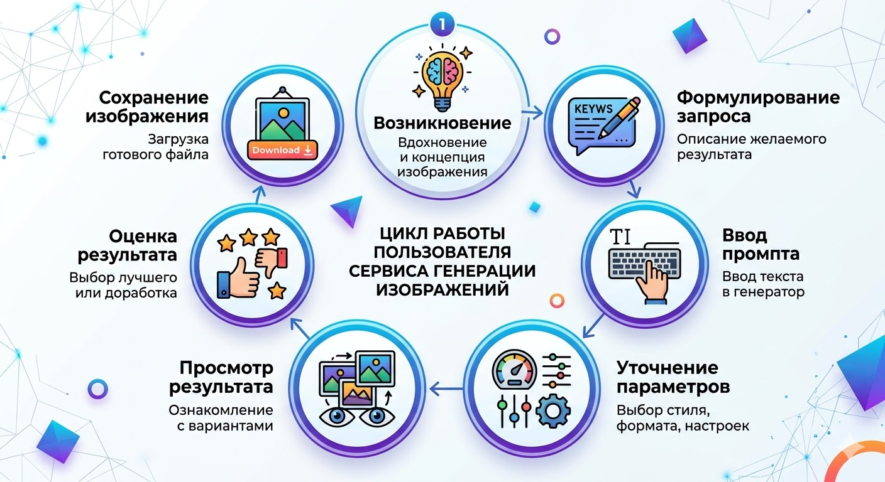

# Выявление требований: Сервис генерации изображений

## 1. Цели и задачи определения пользовательских требований

---

**Цель:**

- Определить и сформулировать пользовательские требования к функциям MVP сервиса генерации изображений.

**Задачи:**

- Выявить ключевые потребности пользователей при создании изображений;
- Сформулировать требования к основным функциям системы (генерация изображений, формирование промптов, управление результатами);
- Определить требования к механизму интеллектуальных подсказок при вводе промптов;
- Зафиксировать выявленные требования в виде пользовательских историй (User Story) и обобщить в Use Case таблице.

> ### 📋 Интерактивная анкета
> Для сбора первичных требований была разработана специализированная форма.
> 🔗 **[Пройти опрос / Посмотреть структуру анкеты (Notion Forms)](https://www.notion.so/31d540bb96d1802aaf6dd36b6bc430d4?v=31d540bb96d180119f5c000c1f6a318a)**

## 3. Jobs to be Done (JTBD) & Job Stories

---

1. Job Story: 

Когда мне нужно подготовить слайды для презентации, ****я хочу получать реалистичные, правдоподобные изображения без визуальных искажений, чтобы я мог сразу вставлять их в слайды и не тратить время на ручную правку результатов.

Job to be done: 

Получить реалистичное изображение, соответствующее запросу, с минимальным уровнем искажений форм, неверного текстового контента, «странных» мелочей, чтобы изображение было готово к использованию в презентации без дополнительной обработки.

1. Job Story:

Когда я начинаю вводить короткий запрос для генерации изображения, я хочу получать несколько релевантных автоподсказок для продолжения промпта, чтобы быстрее сформулировать полный и точный запрос и получить нужный результат с первой попытки.

Job To Be Done:

Преобразовать короткую идею в полный и точный промпт для генерации изображения, чтобы получить релевантный результат без множества итераций.

1. Job Story

Когда я часто использую похожие запросы для генерации изображений, я хочу сохранять и редактировать шаблоны промптов, чтобы быстро использовать их повторно и не вводить один и тот же текст каждый раз.

Job To Be Done:

Повторно использовать ранее созданные запросы для генерации изображений, чтобы ускорить создание нужных результатов и сократить время на ввод промптов.

4. Job Story

Когда я хочу получить изображение в определённом стиле, я хочу загрузить примеры изображений и выбрать подходящий стиль, чтобы результат генерации был максимально похож на то, что я ожидаю.

Job To Be Done:

Задать желаемый стиль и визуальные ориентиры для генерации изображения, чтобы получить результат, соответствующий ожиданиям пользователя.

5. Job Story

Когда я ввожу короткий или недостаточно точный запрос для генерации изображения, я хочу, чтобы система задавала уточняющие вопросы, чтобы точнее сформулировать запрос и получить результат, соответствующий моим ожиданиям.

Job To Be Done:

Уточнить параметры запроса для генерации изображения, чтобы повысить точность и соответствие результата ожиданиям пользователя.

1. Job Story:

Когда я получаю сгенерированное изображение, я хочу иметь возможность оценить результат и оставить краткий комментарий, чтобы система могла учитывать мою обратную связь и со временем предлагать более подходящие изображения.

Job To Be Done:

Предоставить обратную связь о качестве сгенерированного изображения, чтобы улучшить будущие результаты генерации.

7. Job Story:

Когда я отправляю запрос на генерацию изображения, я хочу сначала получить один основной результат, чтобы быстро оценить его и при необходимости запросить дополнительные варианты.

Job To Be Done:

Получить первый результат генерации изображения для быстрой оценки и при необходимости запросить дополнительные варианты, чтобы выбрать наиболее подходящий.

8. Job Story

Когда мне нужно быстро задать запрос для генерации изображения, я хочу иметь возможность вводить промпт текстом или голосом, чтобы выбрать наиболее удобный способ ввода и быстрее начать генерацию.

Job To Be Done:

Задать запрос для генерации изображения удобным способом (текстом или голосом), чтобы сократить время на формулирование промпта и получить результат быстрее.

9. Job Story

Когда я генерирую изображения в сервисе, я хочу, чтобы они автоматически сохранялись в моей облачной галерее и при необходимости могли быть скачаны, чтобы я мог легко найти и использовать их позже.

Job To Be Done:

Сохранить и получить доступ к ранее сгенерированным изображениям, чтобы использовать их в будущем без повторной генерации.

10. Job Story:

Когда при генерации изображения происходит сбой или сервис временно недоступен,
я хочу получать информацию о статусе работы сервиса и иметь возможность повторить генерацию без потери лимита, чтобы продолжить работу без лишних потерь времени и ресурсов.

Job To Be Done:

Получить информацию о состоянии сервиса и возможность повторить генерацию после сбоя, чтобы завершить задачу без потери лимита и времени.

## 4. Сценарии использования (Use Cases & User Stories)

---

| Поле | Описание |
|-----|-----|
| **Идентификатор и название** | UC-01 Генерация изображения по пользовательскому запросу |
| **Автор** | Аналитик проекта |
| **Дата создания** | 09.03.2026 |
| **Основное действующее лицо** | Пользователь сервиса |
| **Дополнительное действующее лицо** | - |
| **Описание** | Пользователь формирует запрос (промпт) для генерации изображения с помощью текстового или голосового ввода. Система может предложить автоподсказки, уточняющие вопросы или стили. После генерации пользователь оценивает результат, и изображение автоматически сохраняется в облачной галерее. |
| **Триггер** | Пользователь открывает интерфейс генерации изображения и начинает вводить запрос. |
| **Предварительные условия** | 1. Пользователь авторизован в системе. 2. Сервис генерации изображений доступен. |
| **Выходные условия** | 1. Сгенерированное изображение отображается пользователю. 2. Изображение автоматически сохраняется в облачной галерее пользователя. 3. Пользователь может оценить изображение и оставить комментарий. |
| **Нормальное направление развития варианта использования** | 1. Пользователь открывает страницу генерации изображения. 2. Пользователь вводит промпт текстом или голосом. 3. Система предлагает автоподсказки для завершения промпта. 4. Пользователь выбирает подсказку или вводит свой текст. 5. Пользователь при необходимости выбирает стиль изображения или загружает референсы. 6. Пользователь отправляет запрос на генерацию. 7. Система генерирует одно изображение. 8. Система отображает результат пользователю. 9. Изображение автоматически сохраняется в облачной галерее пользователя. 10. Пользователь оценивает изображение по шкале 1–5 и при необходимости оставляет комментарий. |
| **Альтернативное направление развития варианта использования** | A1. Пользователь выбирает голосовой ввод вместо текстового. A2. Пользователь загружает до 5 эталонных изображений для задания стиля. A3. Пользователь запрашивает дополнительные варианты изображения. |
| **Исключения** | E1. Сервис временно недоступен — система отображает уведомление о статусе сервиса. E2. Генерация изображения завершается ошибкой — пользователь может повторить запрос без потери лимита. |
| **Приоритет** | Высокий |
| **Частота использования** | По необходимости (несколько раз в неделю или месяц в зависимости от задач пользователя). |
| **Бизнес правила** | 1. Один пользователь может выполнять ограниченное количество генераций изображений в течение заданного периода времени. 2. Для одного запроса генерации пользователь может загрузить не более пяти референсных изображений. 3. По умолчанию система возвращает один результат генерации, при этом пользователь может при необходимости запросить дополнительные варианты. 4. Все сгенерированные изображения автоматически сохраняются в облачной галерее пользователя и хранятся в течение установленного периода времени. 5. В случае ошибки при генерации изображения пользователь имеет возможность повторить запрос без списания установленного лимита генераций. 6. Сервис поддерживает ввод промптов на русском и английском языках. 7. Система применяет правила модерации и может ограничивать генерацию изображений, содержащих запрещённый или неподходящий контент. |
| **Специальные требования** | 1. Время генерации изображения не должно превышать 1 минуты. 2. Распознавание голосового ввода поддерживает русский и английский языки. 3. Интерфейс должен быть простым и удобным для пользователей без технических знаний. |
| **Предположения** | 1. Пользователь имеет доступ к интернету. 2. Пользователь знает, какое изображение хочет получить. 3. Пользователь использует сервис для создания изображений для презентаций или других визуальных материалов. |

## Epic: Базовая генерация и качество результата

**US-01 — Реалистичные изображения по умолчанию**

Как пользователь, я хочу, чтобы по умолчанию генерировались реалистичные изображения, чтобы я мог сразу использовать их без дополнительной доработки.

**US-02 — Выбор предустановленных стилей**

Как пользователь, я хочу выбирать предустановленные стили генерации (например «фотореализм», «иллюстрация», «3D-рендер», «минимализм»), чтобы быстрее получать изображения, соответствующие нужному визуальному направлению.

## Epic: Формирование промпта и подсказки

**US-03 — Автоподсказки при вводе промпта**

Как пользователь, я хочу получать минимум 5 релевантных автоподсказок при вводе промпта, чтобы быстрее собрать полный и точный запрос.

**US-04 — Уточняющие вопросы при некорректном/коротком промпте**

Как пользователь, если мой промпт короткий или неоднозначный, я хочу, чтобы система задала 1–3 уточняющих вопроса, чтобы получить более точный итог.

**US-05 — Поддержка текстового и голосового ввода**

Как пользователь, я хочу вводить промпт текстом или голосом (RU/EN), чтобы выбирать удобный способ ввода.

---

## Epic: Шаблоны и референсы

**US-06 — Сохранение и управление шаблонами промптов**

Как пользователь, я хочу сохранять, переименовывать и применять шаблоны промптов, чтобы быстро повторять удачные формулировки.

**US-07 — Загрузка референсных изображений**

Как пользователь, я хочу загрузить до 5 референсов и применить их к генерации, чтобы результат был ближе к желаемому образцу.

---

## Epic: Результаты и вариативность

**US-08 — Один вариант по умолчанию + опция N вариантов**

Как пользователь, я хочу, чтобы по умолчанию генерировалось 1 изображение, но была опция запросить 2–5 вариантов, чтобы быстро оценить основной результат и при необходимости расширить выбор.

**US-09 — Оценка результата и обратная связь**

Как пользователь, я хочу оценивать сгенерированные изображения по шкале 1–5 и оставлять комментарий, чтобы система училась и улучшала результаты.

---

## Epic: Хранение и экспорт

**US-10 — Автосохранение в облачную галерею**

Как пользователь, я хочу, чтобы все сгенерированные изображения автоматически сохранялись в моей облачной галерее, чтобы я мог их найти позже.

**US-11 — Скачивание копии вручную**

Как пользователь, я хочу иметь кнопку «Скачать», чтобы получить локальную копию изображения.

---

## Epic: Надёжность и обработка ошибок

**US-12 — Информирование о статусе сервиса при сбоях**

Как пользователь, я хочу видеть актуальную информацию о состоянии сервиса при сбое, чтобы понимать, когда повторить попытку.

**US-13 — Повтор без списания лимита при ошибке**

Как пользователь, если генерация не удалась, я хочу повторить попытку без списания квоты, чтобы не терять лимиты за ошибки системы.

**US-14 — SLA: восстановление не более 24 часов**

Как пользователь, я хочу, чтобы сервис восстанавливал работу в пределах 24 часов при серьёзном сбое, чтобы не терять критичную для workflow доступность.

---

## Epic: UX и приоритеты

**US-15 — Быстрая интеграция в слайды (формат/размер/фон)**

Как пользователь, я хочу, чтобы сгенерированные изображения имели опции экспорта (размеры, прозрачный фон), чтобы легко встраивать их в слайды.
